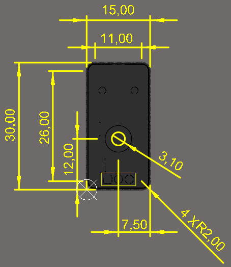
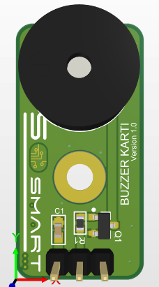
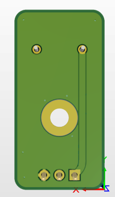
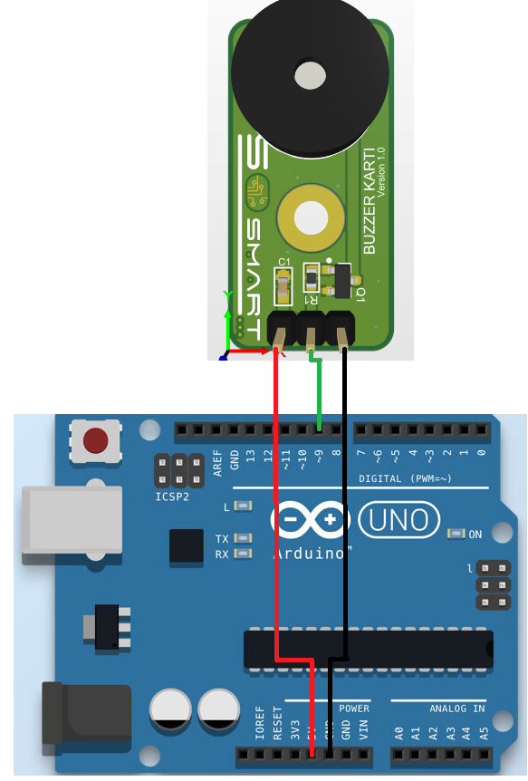
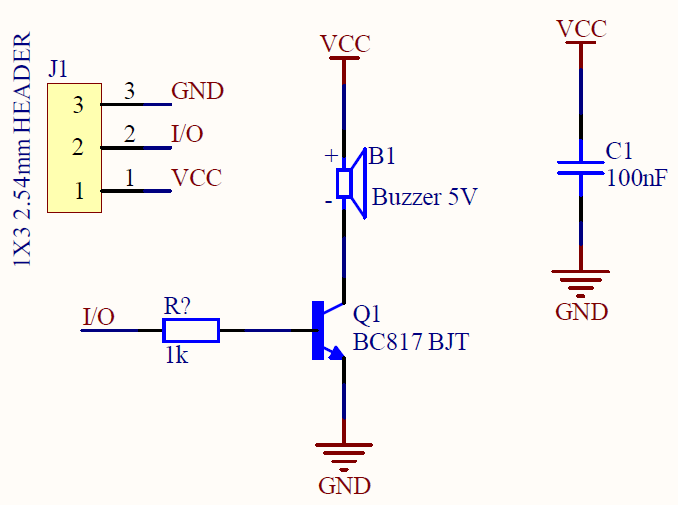

#  Buzzer Kartı

### 1. KAPSAM

Bu döküman Buzzer Kart'ının tanımını ve çalışma prensibini açıklar.

### 2. ÜRÜN PARAMETRELERİ

- 1 Çalışma Gerilimi: DC +5V
- 2 Çalışma Sıcaklığı:-20℃~ +70℃
- 3 Çalışma Frekansı:2300 Hz ±300
- 4 Ses Çıkışı: Min 85dB

### 3. MEKANİK




Pdf [Buzzer](Mechanic/Buzzer.pdf)

### 4. PİN AÇIKLAMALARI

|Pin Adı|Açıklama|
|------|------|
|+5V|DC +5V besleme pimi|
|I/O|MCU giriş/çıkış pimi|
|GND|Toprak bağlantı pimi|

### 5. Arduino Bağlantısı




### 6. Devre


Sch File [Buzzer](Circuit/Buzzer.pdf) 

Bom List [BomList](Circuit/Buzzer-BomList.pdf) 

Gerber File [Gerber](Circuit/Buzzer-Gerber.zip) 

### GENEL BAKIŞ
Buzzer Kartı elektronik projelerinde buzzer kullanımını kolaylaştırmak amacıyla tasarlanmıştır..Prototiplemeye imkan sağlaması, arduino ve çeşitli devrelerde rahatça kullanılabilmesi için gerekli pinler devre kartı sayesinde dışarıya alınmıştır.Standart pin yapısı sayesinde rahatça kontrol edilebilir. Jumper kablolar ile bağlantıları yapılabilir.

### Arduino Örnek Kodu
```
int buzzer=9;

void setup (){
pinMode(buzzer,OUTPUT);
  
  }
void loop(){
  digitalWrite(9,HIGH);
  delay(1000);
  digitalWrite(9,LOW);
  delay(1000);
  }


```

[buzzer](ArduionoExample/buzzer/buzzer.ino)

